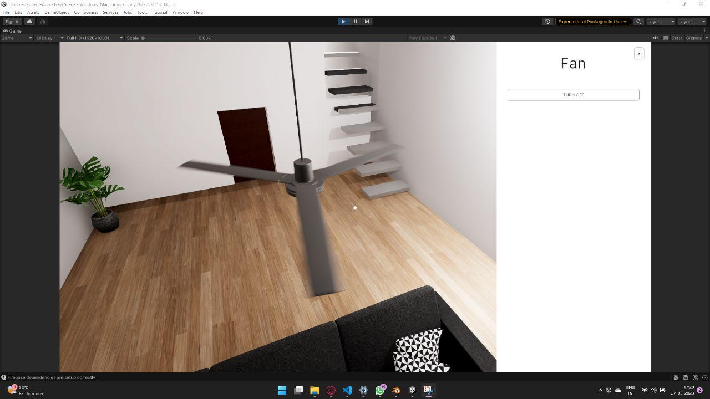

# UloSmart 3D Interactive Home Automation
## Table of Contents
- [Introduction](#introduction)
- [Features](#features)
- [Technology Stack](#technology-stack)
- [Screenshots](#screenshots)

## Introduction
This 3D Automated Smart Home application provides a fully immersive experience, allowing users to virtually explore and interact with a digital replica of their home. Through this virtual interface, users can control real-world smart devices, manage home settings, and monitor various aspects of their environment.

 

Gas Leak Warning System

 

Interaction with components

 

Interaction result

## ✨ Features
- **Virtual Home Interaction**: Navigate through a 3D rendition of your home and control devices like lighting, thermostats, security cameras, and more.

- **Real-Time Smart Home Control**: Seamlessly adjust your actual home’s smart features through the virtual interface.

- **Built-In Assistant**: Get real-time alerts for potential hazards such as gas leaks, fires, and unauthorized access, ensuring your home stays safe and secure.

## ⚒️ Technology Stack
### Software
- The **Interactive 3D Virtual Home** was developed using **Unity3D**.
- The **3D objects and other assets** used to built the 3D Virtual Home were created using **Blender**.
- **Firebase** was used as the **database** and Single Source of truth for the **state of the different Electronic Components.**
- The **User Interface** and **Arduino Board** was programmed using C# and C++ respectively.

### Hardware
- An **Arduino Uno Board**

## 📸 Screenshots

Gas Leak Warning System

 

Interaction with Tubelight

 

Tubelight Interaction result

 

Fan Controls

 

Smart Home Room

 

Smart Home Room

 

Home Model

 

Arduino UNO Board

 

Relay

 

NodeMCU

 
